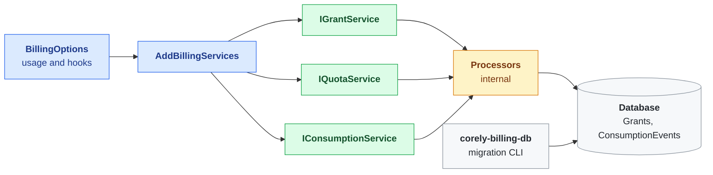

# Corely.Billing Documentation

Grants, consumption and quota for .NET applications. Records what an account was given, what it used, and whether any is left. It serves a metered pipeline with reservations and retries, and just as well a subscription, prepaid credits, a trial, or feature access. Supports SQL Server and MySQL.



Blue is what the host configures, green is the public API, amber is internal, grey is the schema and the tool that owns it.

- **Grants** — an account's allowance of a unit for an operation, valid for a window, limited or unlimited
- **Usage shapes** — metered, subscription, prepaid credits, trial, or seats, from the same schema
- **Reservations** — quota is held before work starts and settled to what the work cost
- **Grant-edge splitting** — work larger than one grant's remainder draws from the next, soonest-expiring first
- **Idempotent retries** — a retried unit of work recognises its own earlier rows instead of charging twice
- **Overdraft-once** — work already paid for is always recorded, and the overrun stays visible
- **Registered vocabulary** — operations and units are host-defined tokens, validated on every write
- **Host-owned authorization** — decorate the three services; nothing about users or permissions is assumed

## Topics

- [Step-by-Step Setup](step-by-step-setup.md)
- [Usage Shapes](usage-shapes.md)
- [Demos](demos.md)
- [BillingOptions Configuration](billing-options.md)
- [Usage Vocabulary](usage-vocabulary.md)
- [Operation Context](operation-context.md)
- [Reservations](reservations.md)
- [Services](services/index.md)
    - [Grant Service](services/grant-service.md)
    - [Quota Service](services/quota-service.md)
    - [Consumption Service](services/consumption-service.md)
- [Authorization](authorization.md)
- [Telemetry](telemetry.md)
- [Architecture](architecture.md)
- [Result Codes](result-codes.md)

### Tools

- [Migration CLI](../../Corely.Billing.DataAccessMigrations.Cli/Docs/index.md) — database creation, migrations, scripting
- [Corely.Billing.Web](../../Corely.Billing.Web/Docs/index.md) — Blazor components for grants and usage
- [Corely.Billing.IAM](../../Corely.Billing.IAM/Docs/index.md) — Corely.IAM permissions for the three services
- [Corely.Billing.Web.IAM](../../Corely.Billing.Web.IAM/Docs/index.md) — IAM's `PermissionView` on each grant action

## Quick Start

```csharp
var options = BillingOptions.Create(configuration, efConfigFactory)
    .RegisterOperation("document_extraction", "Document Extraction")
    .RegisterUnit("page", "page");
services.AddBillingServices(options);

using var operation = accessor.BeginScope(new OperationContext(correlationId, "job:42/step:extract"));

var reserved = await quotaService.ReserveAsync(
    new ReserveQuotaRequest(accountId, extraction, page, Quantity: 1, Provider: "mistral"));
// ... do the work ...
var settled = await quotaService.SettleAsync(
    new SettleQuotaRequest(accountId, extraction, page, ActualQuantity: 37));
```

## Database Providers

| Provider | Migrations project |
|----------|--------------------|
| SQL Server | `Corely.Billing.DataAccessMigrations.MsSql` |
| MySQL | `Corely.Billing.DataAccessMigrations.MySql` |

Both are bundled into the `corely-billing-db` tool. The library never applies migrations at runtime.
