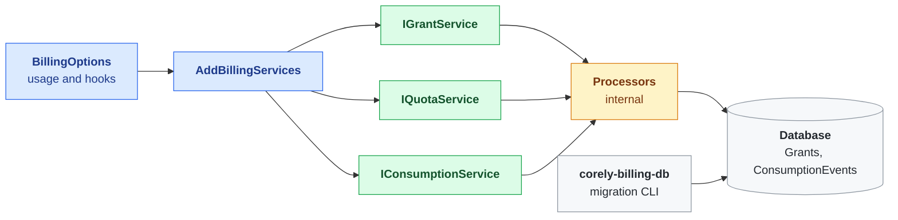

# Corely.Billing

Grants, consumption and quota for .NET applications. Records what an account was given, what it used, and whether any is left — kept reconciled across retries, so a replayed unit of work is never charged twice.



## Highlights

- **Grants** — an account's allowance of a unit for an operation, valid for a window
- **Reservations** — quota is held before work starts and settled to what the work cost
- **Grant-edge splitting** — work larger than one grant's remainder draws from the next, soonest-expiring first
- **Idempotent retries** — a retried unit of work recognises its own earlier rows instead of charging twice
- **Overdraft-once** — work already paid for is always recorded, and the overrun stays visible
- **Registered vocabulary** — operations and units are host-defined tokens, validated on every write
- **Host-owned authorization** — decorate the public services; no identity library is referenced
- **Two database providers** — SQL Server and MySQL via EF Core

## Quick Start

### 1. Create the database schema

The library never applies migrations at runtime. Create the schema with the migration tool, which
ships both providers' migrations:

```bash
dotnet tool install --global Corely.Billing.DataAccessMigrations.Cli

corely-billing-db db create -p MsSql -c "Server=(localdb)\MSSQLLocalDB;Database=MyApp;Trusted_Connection=True;"
```

See the [Migration CLI docs](https://github.com/ultrabstrong/Corely.Billing/blob/master/Corely.Billing.DataAccessMigrations.Cli/Docs/index.md) for deployment
scripting, environment-variable configuration, and running against MySQL.

### 2. Register and use the services

```csharp
var options = BillingOptions.Create(configuration, efConfigFactory)
    .RegisterOperation("document_extraction", "Document Extraction")
    .RegisterUnit("page", "page");
services.AddBillingServices(options);

using var scope = accessor.BeginScope(new OperationContext(correlationId, $"job:{jobId}/step:extract"));

await quotaService.ReserveAsync(new ReserveQuotaRequest(accountId, extraction, page, 1, "mistral"));
var pages = await ExtractAsync(document);
await quotaService.SettleAsync(new SettleQuotaRequest(accountId, extraction, page, pages));
```

## Documentation

| Docs | Description |
|------|-------------|
| **[Corely.Billing](https://github.com/ultrabstrong/Corely.Billing/blob/master/Corely.Billing/Docs/index.md)** | Core library — setup, services, reservations, architecture |
| [Migration CLI](https://github.com/ultrabstrong/Corely.Billing/blob/master/Corely.Billing.DataAccessMigrations.Cli/Docs/index.md) | Database creation, migrations, and scripting |

## Solution Structure

| Project | Purpose |
|---------|---------|
| `Corely.Billing` | Core library — grants, the consumption ledger, quota |
| `Corely.Billing.ConsoleTest` | Zero-setup demo: grant, reserve, settle on SQLite |
| `Corely.Billing.UnitTests` | Unit tests on mock repositories |
| `Corely.Billing.IntegrationTests` | SQLite tests, plus an opt-in SQL Server and MySQL matrix |
| `Corely.Billing.DataAccessMigrations.Cli` | Migration CLI — creates and migrates the billing schema (published as a .NET tool) |
| `Corely.Billing.DataAccessMigrations.MsSql` / `.MySql` | EF Core migrations per database provider, bundled into the CLI |

## License

See [LICENSE](https://github.com/ultrabstrong/Corely.Billing/blob/master/LICENSE) for details.
